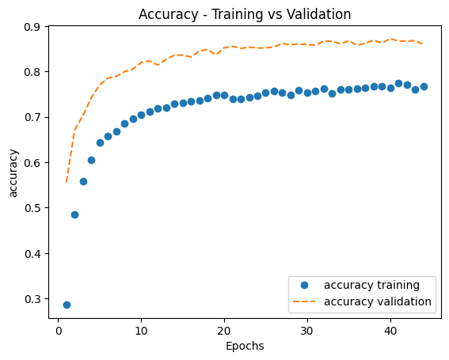
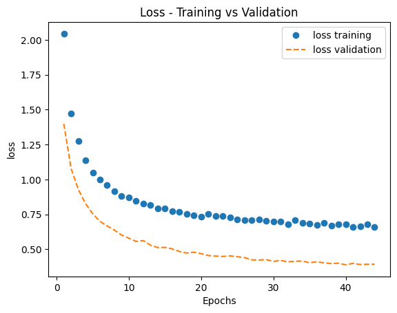
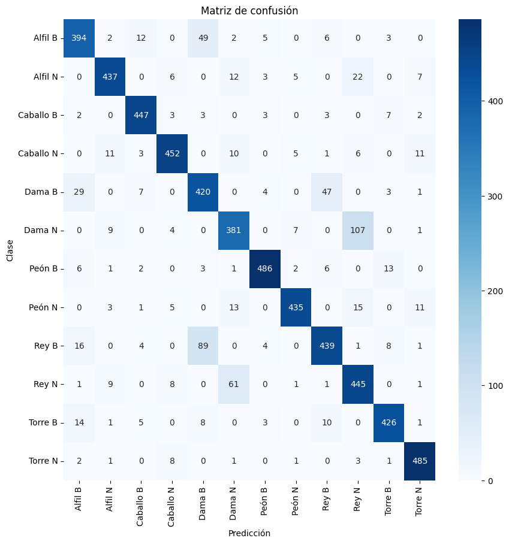
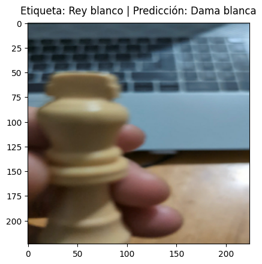
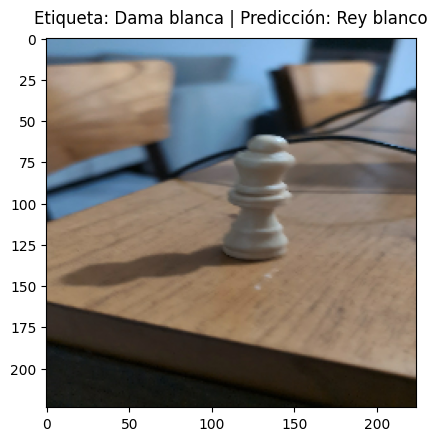
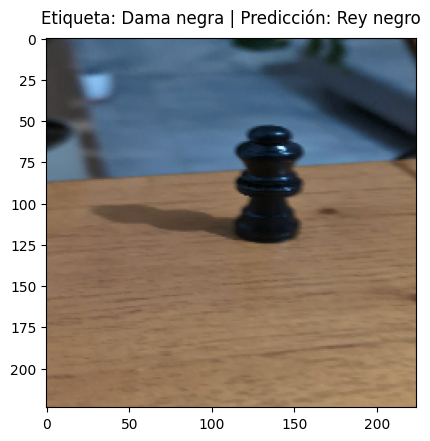
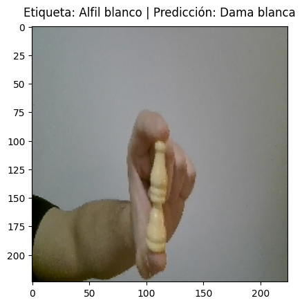
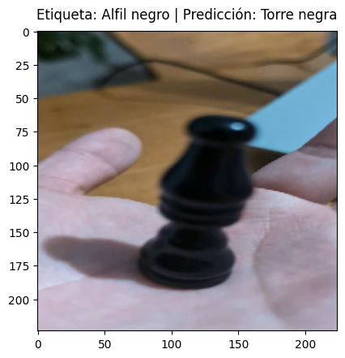
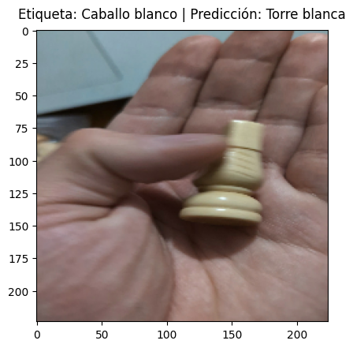

# Detección de piezas de ajedrez

En este proyecto lo que busco es practicar el proceso de **creación de datasets, transfer learning y clasificación por imágenes.**

## Clases  
Las **categorías** en las que clasifica el modelo son las siguientes: 
- Rey blanco
- Rey negro
- Dama blanca
- Dama negra
- Torre blanca
- Torre negra
- Alfil blanco
- Alfil negro
- Caballo blanco
- Caballo negro
- Peón blanco
- Peón negro

## **Dataset**

El dataset de este proyecto se construyó **mediante la grabación de videos de las diversas piezas de ajedrez**, desde diversos ángulos y cámaras facilitando de esta manera la clasificación de ellas mediante visión por computadora. Estos videos fueron convertidos en imágenes utilizando la librería de Python **OpenCV (cv2)** para recortar frames y guardarlos como imagen de su categoría.
Este dataset creado cuenta con una cantidad de 20032 imágenes distribuidas entre las 12 categorías, estas imágenes son separadas en un **70%** para training y un **30%** para test.

## **Estructura del proyecto**
- [Notebook 1 - Creación del dataset:](https://colab.research.google.com/drive/15RP-G3x-w9T5UsKsjXOBIG-59QkyLjtd?usp=sharing) **Construcción del dataset** mediante extracción de frames de videos grabados. 
- [Notebook 2 - Entrenamiento del modelo:](https://www.kaggle.com/code/ramif13/notebook-2-entrenamiento-del-modelo) **Aplicación de transfer learning** con MobileNetV2 y visualización de métricas del modelo. En este caso utilicé Kaggle por la disponibilidad de la GPU T4 con un límite más amplio de sesión.
- [Notebook 3 - Predicciones erróneas:](https://colab.research.google.com/drive/1kYSWzQmKSuHT-0-cSzdBgR5YMNkKmeRP?usp=sharing) **Evaluación del modelo**, predicciones erróneas y análisis de los mismos.
- **demo.py** (Archivo adjunto en github)
## **Modelo**
Utilicé el modelo **MobileNetV2** para realizar transfer learning. No realicé fine-tuning ya que para un dataset como el creado la base congelada provee features suficientemente representativas, manteniendo el modelo liviano y reduciendo riesgo de overfitting.
Los hiperparámetros utilizados son:
-  **Arquitectura:**
    - **MobileNetV2:**
    Este es un modelo preentrenado sobre ImageNet, utilizado para extracción de features con la base congelada. Realicé la elección de este modelo ya que es liviano, eficiente y bueno para datasets pequeños como el creado.
    Adapté la salida del modelo mediante una capa **GlobalAveragePooling2D** que reduce el tensor de salida de **MobileNetV2 (7, 7, 1280)** a un vector de **1280 features**, a esta capa le sigue un **Dropout(0.2)** para reducir el overfitting y por último una capa **Dense(12, softmax)** que distribuye la predicción en una probabilidad de pertenencia entre 0 y 1 para cada una de las 12 categorías a clasificar.
- **Entrenamiento:**
    - **Optimizer:** Adam, learning_rate: 3e-4, utilicé este parámetro ya que permite que el aprendizaje de las nuevas capas sea estable y no oscilen los gradientes.
    - **Epochs:** 50, decidí utilizar esta cantidad por su lenta convergencia. Utilizando EarlyStopping con Patience = 4, que permite evitar overfitting.
    - **Batch size:** 32, estabiliza el gradiente y el uso de memoria GPU. 
    - **Loss:** categorical_crossentropy, esta lo utilicé ya que es el estándar para la clasificación multiclase con softmax. 
- **Data Augmentation:** Utilicé los siguientes parámetros para sacar mayor provecho del pequeño dataset agregándole capacidad de generalización al modelo simulando variaciones de ángulo, posición y zoom.
    - **rotation_range:** 40
    - **zoom_range:** 0.3
    - **height/width:** 0.3
    - **horizontal_flip:** True

## **Resultados** 
El modelo presentó una accuracy en la partición de validación de un **0.85 (85%)** y un **0.88  (88%)** en el conjunto de prueba (test).

Gráfico de **training vs validation - Accuracy** 

Gráfico de **training vs validation - Loss** 

**Matriz de confusión** 

## **Análisis de errores**
El modelo suele fallar en ciertos casos. Usualmente por la **similitud visual entre piezas y ángulos extremos**.
- Estas fallas son el resultado de la similitud entre clases, entre ellas las más comunes: 
    - Rey y dama, estas se confunden mucho entre sí. Podemos ver estos números en la matriz de confusión.
        - Rey y dama blancos poseen **98 casos** en los que se confunden, mientras que en el caso de rey y dama negros es de **75 casos**.
    - Alfil y dama, aunque confundidas en menor cantidad que la anterior conforman un gran porcentaje de confusión del modelo.
        - Alfil y dama blancos poseen **16 casos** en los que fueron confundidos y en caso del alfil y dama negros cuentan con **20 casos** de confusión.

Ejemplos reales con imágenes con las que el modelo fue evaluado: 

**Error 1:** El rey y la dama comparten en gran parte sus características distintivas, en este caso al estar recortada y solo verse el mayor rasgo distintivo de la clase puede confundírsele con una dama. Es un error de encuadre.

**Error 2:** Pieza con mucho ruido en el fondo. La dama comparte silueta con el rey, y ante la falta de nitidez de la imagen en el detalle superior de la pieza el modelo no logra distinguirla. 

**Error 3:** Mismo problema que el **error 2** en un fondo similar. Distancia excesiva entre la cámara y la pieza, esta pierde calidad y el modelo no logra distinguirla del rey.

- **Otros ejemplos de casos de confusión:**

**Error 4:** Al estar alejada, las características distintivas del alfil pierden definición viéndose más similar a una dama. 

**Error 5:**  El modelo no logra aislar la pieza ya que el fondo de la imagen presenta mucho ruido, el modelo no logra captar las características distintivas del alfil. Resalta una limitación en la creación de las imágenes del dataset.

**Error 6:** Se ve la pieza fuera de foco, con la cabeza del caballo girada y ocluida por la mano. Al perder el rasgo más distintivo de la clase y verse muy similar a la torre el modelo opta por ella.

## **Demo en tiempo real**

Video de demostración del archivo **demo.py**:
[Ver demo](https://youtu.be/8Jen8Au5JRQ)

Para ejecutar el archivo **demo.py** en un entorno local debemos tener el archivo [modelo](https://drive.google.com/file/d/1Kx-1AYfi5yQFh6dd0-7x1BbjRlhEZHaI/view?usp=sharing) en la misma carpeta que el archivo. 
Al presionar la letra **q** finaliza la ejecución del programa.

## **Requisitos**

Para la correcta ejecución del archivo **demo.py** deben de estar instaladas las siguientes librerías:
- **tensorflow 2.21.0**
- **keras 3.14.0**
- **opencv-python 4.13.0.92**
- **numpy 2.4.4** 

